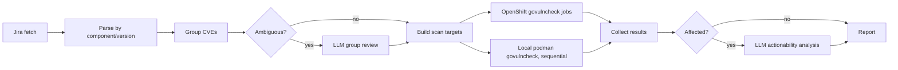

# edge-cve

Investigate open **Black** CVE Jira tickets for OpenShift edge components.
Deterministic scripts fetch and structure tickets; `govulncheck` runs against
target repositories either as OpenShift Jobs or, for local testing, as
sequential podman containers; LLM agents handle ambiguous grouping and
actionability analysis.

## Quick start

```bash
# Prerequisites
export JIRA_BASE_URL=https://redhat.atlassian.net
export JIRA_EMAIL=you@redhat.com
export JIRA_API_TOKEN=<token>

# Full workflow via skill
/edge-cve:investigate

# Or run scripts directly (OpenShift)
WORKDIR=/tmp/edge-cve-workdir.$(date +%y%m%d)
bash plugins/edge-cve/scripts/cve-investigator.sh prepare --workdir "$WORKDIR"
bash plugins/edge-cve/scripts/cve-investigator.sh scan --workdir "$WORKDIR" --repo openshift/lvm-operator --dry-run
bash plugins/edge-cve/scripts/cve-investigator.sh scan --workdir "$WORKDIR" --repo openshift/lvm-operator
bash plugins/edge-cve/scripts/cve-investigator.sh collect --workdir "$WORKDIR" --repo openshift/lvm-operator
bash plugins/edge-cve/scripts/cve-investigator.sh finalize --workdir "$WORKDIR"

# Or run scan locally with podman instead (no cluster required)
bash plugins/edge-cve/scripts/cve-investigator.sh scan-local --workdir "$WORKDIR" --repo openshift/lvm-operator
bash plugins/edge-cve/scripts/cve-investigator.sh finalize --workdir "$WORKDIR"

# --repo is repeatable to scope to a set of repositories
bash plugins/edge-cve/scripts/cve-investigator.sh scan --workdir "$WORKDIR" \
  --repo openshift/lvm-operator --repo openshift/microshift

# Ad-hoc: is one repo/ref affected right now? No Jira/workdir setup needed.
bash plugins/edge-cve/scripts/cve-investigator.sh check-repo \
  --repo-url https://github.com/openshift/lvm-operator --ref release-4.18 --cve CVE-2024-99999
```

## Jira scope

Only tickets matching this JQL are in scope:

```jql
filter = "All Open CVEs" AND filter = "All Open Black CVEs"
```

This matches the saved filter intersection at:

https://redhat.atlassian.net/issues/?filter=92079&jql=filter%20%3D%20%22All%20Open%20CVEs%22%20and%20filter%20%3D%20%22All%20Open%20Black%20CVEs%22

## Workflow



Both execution paths run the exact same scan logic (`scan_target.sh` +
`process_govulncheck_result.go`); only how the result is published differs
(Kubernetes ConfigMap vs. local file).

## Scripts

| Script | Purpose |
|--------|---------|
| `fetch_cves.py` | Pull Black CVE tickets from Jira |
| `parse_cves.py` | Extract CVE IDs, components, versions, repos |
| `group_cves.py` | Deterministic grouping; flags ambiguous groups |
| `build_scan_targets.py` | Unique repo/ref targets for scanning |
| `run_govulncheck_jobs.sh` | Apply OpenShift jobs via `oc` (supports repeatable `--repo` filter) |
| `collect_govulncheck_results.py` | Read result ConfigMaps (supports repeatable `--repo` filter) |
| `run_govulncheck_podman.sh` | Run govulncheck sequentially via podman, no cluster required (supports repeatable `--repo` filter) |
| `scan_target.sh` | Shared clone/build/scan logic used by both the OpenShift Job and the podman runner |
| `run_single_repo_scan.sh` | Ad-hoc single repo@ref scan via podman, no scan-targets.json/Jira data required |
| `analyze_scan_result.py` | Deterministic verdict + `suggested_agent_prompt` for a single scan result |
| `generate_report.py` | Markdown report + remediation prompts |
| `generate_html_report.py` | Browsable HTML report, grouped by component/version, private tickets redacted |
| `cve-investigator.sh` | Orchestrator (`prepare`, `scan`, `collect`, `scan-local`, `finalize`, `check-repo`) |

## Configuration

Edit `config/component-repos.json` to map Jira components to GitHub repositories
and release branch templates. Each ticket's Jira versions (e.g. `4.18`) are
rendered through `version_ref_template` (e.g. `release-{version}`) to produce
the git refs we scan - we deliberately do **not** also scan tip-of-tree
(`main`/`master`) for versioned components, since that would capture far more
than the ticket is asking about. Leave `version_ref_fallbacks` empty for
versioned components; it is only consulted when a ticket has no version at
all. Tickets with a known repo but no resolvable release ref are skipped
(flagged `no_git_ref_resolved`) rather than silently pointed at `main`.

## Python dependencies

```bash
pip install requests
```

## OpenShift prerequisites

- `oc` CLI logged into the target OpenShift cluster (`oc login`)
- Applies `k8s/namespace.yaml`, `k8s/rbac.yaml` (ServiceAccount/Role/RoleBinding), and one Job per target
- Jobs use `registry.redhat.io/ubi9/go-toolset:1.23` (OpenShift arbitrary-UID compatible), clone the repo at the target ref, and run `govulncheck -json ./...`
- `GOTOOLCHAIN=auto` lets Go auto-download a newer toolchain if `govulncheck@latest` requires one (needs egress to `proxy.golang.org` / `go.dev`)
- No `hostUsers`/`fsGroup`/explicit `securityContext` is set — the namespace's default SCC (typically `restricted-v2`) assigns UID/GID automatically
- Cluster must be able to pull from `registry.redhat.io`

## Result storage

Each job publishes its result directly to the Kubernetes API as a ConfigMap
(`process_govulncheck_result.go` uses the mounted `edge-cve-scanner` service
account token — no PVC, shared storage, or collector pod involved). This
avoids exec/copy flakiness on clusters with slow or unreliable storage.

- ConfigMap name: `govulncheck-result-<target-id>`
- Labels: `app.kubernetes.io/name=edge-cve-govulncheck-result`, `edge-cve/target-id=<target-id>`, `edge-cve/repo=<sanitized-repo-slug>`
- Data key: `result.json` — curated summary (`affected`, `scan_incomplete`, `matched_findings`, `cve_ids`, `ticket_keys`, `stderr_tail`, etc.)

The raw, unfiltered `govulncheck -json` output is **not** stored in the
ConfigMap — for real repos it easily runs from hundreds of KB to tens of MB
(see e.g. the ~20k-line output for `lvm-operator@main`), which is both far
over the ConfigMap's ~1MiB total size limit and not practically useful once
inside one. `matched_findings` in `result.json` already carries the
CVE-relevant subset. If you need the full raw output for debugging, use the
local podman path (below), which writes it to disk uncapped.

`scan_incomplete` is `true` when `scan_exit_code > 128` — i.e. the container
was terminated by a signal (137 = SIGKILL, almost always an OOM kill) before
govulncheck finished. In that case `/tmp/govulncheck.json` is partial/empty,
so `affected: false` does **not** mean "not affected" — it means the scan
never completed. `generate_report.py` treats `scan_incomplete` tickets as
`inconclusive`, never `not_affected`, so a killed scan can't be mistaken for
a clean result.

Query results directly, e.g.:

```bash
oc -n edge-cve-scans get configmaps -l edge-cve/repo=openshift--lvm-operator
```

## Job resource limits

Each scan job/container requests `250m` CPU / `1Gi` memory, with limits of
`2` CPU / `4Gi` memory and `3Gi` `ephemeral-storage`. `govulncheck`'s
source-mode call-graph analysis (plus the go1.25 toolchain download it
triggers via `GOTOOLCHAIN=auto` for modules requiring a newer Go) can need
several GB of RAM even for a moderately sized operator repo — 1-2Gi is not
enough and gets SIGKILL'd (`scan_exit_code: 137`). OpenShift Jobs also cap
the `workspace` `emptyDir` at `3Gi` and set `activeDeadlineSeconds: 1800`, so
a bad repo/module still can't monopolize cluster capacity indefinitely when
many jobs run concurrently. If you still see exit 137, raise
`limits.memory` in `k8s/govulncheck-job.yaml.template` (or `--memory` for
podman) further.

## Local execution (podman)

`run_govulncheck_podman.sh` runs the same `scan_target.sh` clone/build/scan
logic as the OpenShift Job, one target at a time, in disposable podman
containers — no cluster, namespace, RBAC, or ConfigMaps required:

```bash
bash plugins/edge-cve/scripts/run_govulncheck_podman.sh --workdir "$WORKDIR" --repo openshift/lvm-operator
# Bigger/slower repo needing more headroom?
bash plugins/edge-cve/scripts/run_govulncheck_podman.sh --workdir "$WORKDIR" --repo openshift/lvm-operator --memory 6g --cpus 4
```

- Requires `podman` and pull access to `registry.redhat.io`.
- `process_govulncheck_result.go` detects local mode via the `RESULT_DIR` env
  var (set by the podman script) and writes `result.json` plus a full,
  uncapped copy of the raw `govulncheck.json` output to
  `${WORKDIR}/scans/results/<target-id>/` instead of publishing a ConfigMap —
  local disk isn't limited the way a ConfigMap is, so nothing is truncated.
- A named podman volume (`edge-cve-govulncheck-gocache`) is reused across
  targets to cache the Go toolchain and module downloads between sequential
  runs. The repo clone and Go build cache (`go clean -cache`) are removed
  inside the container after every target (see `scan_target.sh`) so this
  volume only grows with genuinely reusable data (modules/toolchains), not
  with the ephemeral checkout or build objects.
- After all targets finish, results are aggregated into
  `${WORKDIR}/scans/govulncheck-results.json` — the same shape
  `collect_govulncheck_results.py` produces — so `finalize` works unchanged.
  There is no separate `collect` step for local runs.
- Default container limits are `--memory 6g --cpus 3` (override with
  `--memory`/`--cpus`) — the same "don't consume the whole machine" guardrail
  as the OpenShift Job resource limits. If a target is OOM-killed
  (`scan_exit_code: 137`, logged as "OOM-killed"), re-run with a higher
  `--memory`; its `result.json` will have `scan_incomplete: true` so it's
  never mistaken for a clean "not affected" result.
- Each target gets a named container (`edge-cve-scan-<target-id>`) and a
  `--timeout` wall-clock cap (default 1800s, override with `--timeout`). If a
  clone or toolchain download hangs past the timeout, the container is
  force-removed rather than left running indefinitely — this is what
  previously orphaned a multi-GB container and filled up the podman VM's
  disk. By default the script also runs a light `podman system prune -f`
  before starting to reclaim space from any containers/images left behind by
  a prior interrupted run; pass `--no-prune` to skip it.
- If the podman machine's disk still fills up (e.g. from unrelated images on
  the same machine), reclaim space with `podman system prune -f` (safe,
  leaves named volumes alone) or, more aggressively,
  `podman image prune -a -f --filter until=720h` to drop any image unused for
  30+ days.

## Ad-hoc single-repo check

`cve-investigator.sh check-repo` (or `/edge-cve:investigate --check-repo`) is
a lightweight alternative to the full prepare/scan/finalize pipeline for
"is this one repo/ref affected, right now" questions - no Jira ticket or
`scan-targets.json` needed:

```bash
bash plugins/edge-cve/scripts/cve-investigator.sh check-repo \
  --repo-url https://github.com/openshift/lvm-operator --ref release-4.18 \
  --cve CVE-2024-99999 --jira-url https://redhat.atlassian.net/browse/EDGE-123
```

- Clones the repo@ref and runs `govulncheck` via podman (`run_single_repo_scan.sh`,
  reusing the same `scan_target.sh`/hardening as `run_govulncheck_podman.sh`:
  named container, wall-clock `--timeout`, cleanup on exit, shared
  `edge-cve-govulncheck-gocache` volume for speed).
- `--cve` is repeatable and optional - omit it for a general "any known
  vulnerability at this ref" check instead of a specific-CVE check.
- `analyze_scan_result.py` then deterministically (no LLM call) computes a
  `verdict` (`affected` | `not_affected` | `inconclusive`) and prints JSON
  with a `suggested_agent_prompt` field: a ready-to-use remediation prompt
  built from the scan's own matched findings when the repo is affected, or
  `null` when it isn't. `inconclusive` (e.g. an OOM-killed scan) gets a
  prompt that says to re-run with more memory rather than to write a fix.
- Optional `--ticket`, `--summary`, `--component` add more context to the
  generated prompt; none are required.

## HTML report

`finalize` (and `/edge-cve:investigate`'s Step 4) also writes
`report-cve-investigation.html` via `generate_html_report.py` - a
self-contained, dependency-free HTML file (no CDN/JS framework - safe to open
offline or attach to an email/Slack message):

- **Scoped to components we actually track**: only components listed in
  `config/component-repos.json` (e.g. MicroShift, Logical Volume Manager
  Storage) are shown - the Black CVE filter spans hundreds of components
  across the whole org, so everything else is dropped (not just collapsed)
  before rendering. The dropped count and the exact component list used are
  both printed on stdout (`known_components`, `dropped_unmapped_components`)
  so this is a visible, deterministic filter, not missing data. Override
  with `--config PATH` if you need a different mapping file.
- Grouped by Jira **component**, then by **affected version**; each ticket's
  CVE ID(s) link back to its Jira ticket, with a colored verdict badge
  (`AFFECTED` / `NOT AFFECTED` / `INCONCLUSIVE` / `NOT SCANNED`) and, when
  scanned, the govulncheck status per repo@ref - including the actual
  matched finding(s) (vulnerability ID + module, via the same formatting as
  `analyze_scan_result.py`), not just the pass/fail badge.
- A separate **"Ad-hoc repo checks"** section lists every `check-repo` run
  found under `<workdir>/scans/results/*/analysis.json` - so validating
  `openshift/microshift` or `openshift/lvm-operator` directly (outside the
  Jira pipeline) still shows up in the same report, as long as it used the
  same `--workdir`. These are kept separate from the ticket tables above
  since an ad-hoc check may have no corresponding Jira ticket at all.
- A client-side text filter (plain JS, no network calls) narrows down to
  matching CVE/ticket/component/repo text across both sections.
- **Private tickets are redacted**: any ticket whose Jira Security Level or
  labels contain "private" (see `lib.cve_extract.is_private_ticket`) renders
  as nothing but a lock icon and a link to the Jira ticket - no CVE ID,
  summary, or govulncheck findings are included in the HTML for those. This
  is computed once in `parse_cves.py` (`is_private`/`security_level` fields)
  and enforced again at render time in `generate_html_report.py`.
- Like every other asset in the pipeline (`jira/cves-*.json`, `scans/*.json`,
  `report-cve-investigation.md`), the HTML report always lives under
  `--workdir` - there's no separate `--output` flag, so a report can never
  end up outside the run's own directory. Regenerate it without re-scanning:
  `python3 plugins/edge-cve/scripts/generate_html_report.py --workdir "$WORKDIR"`

## Outputs

- `report-cve-investigation.md` — team notification report (markdown)
- `report-cve-investigation.html` — same data, browsable/filterable HTML (see above)
- `remediation-prompts.md` — agent prompts for actionable CVEs
- `jira/cves-llm-review.json` — groups needing LLM review before scanning
- `check-repo`: prints its JSON result (including `suggested_agent_prompt`)
  directly to stdout and writes it to
  `<workdir>/scans/results/<target-id>/analysis.json`

## Design principles

- **Deterministic first**: Jira parsing, grouping, repo resolution, and report structure are code-driven.
- **LLM for judgment**: grouping review, govulncheck interpretation, and remediation planning only.
- **Black CVEs only**: the JQL filter intersection is fixed and must not be broadened.
